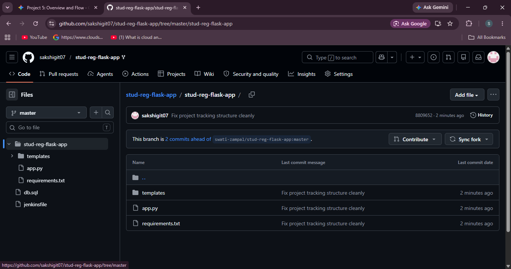

# Title: Flask-Based Student Registration Web Application deployed using Jenkins

## **Project Overview:**

This project involves designing a simple web application that mimics a student
registration system. The goal is to gain hands-on experience in web development,
form handling, backend logic, and data storage using Python Flask and standard
frontend technologies.

### **Technology Stack:**

- **Frontend**: HTML, CSS
- **Backend**: Python (Flask)
- **Database**: MySQL
- **Version Control**: Git & GitHub
- **Deployment (Optional)**: EC2

## **Setup instructions**

### 1. GitHub files:

- Tree structure

```html
stud-reg-flask-app
│   app.py
│   db.sql
│   Jenkinsfile
│   requirements.txt
│   
└───templates
        edit.html
        register.html
        students.html
```

- Push all GitHub files to repository.

#### 2. Launch 3 EC2 instance

- Name server 1 as - `Jenkins master`
- Name server 2 as - `Flask server`
    - Click **Edit inbound rules**.
    - Add a new rule with these settings:
        
        For Flask
        
        - **Type:** `Custom TCP`
        - **Port Range:** `5000`
        - **Source:** `Anywhere-IPv4` (`0.0.0.0/0`)
        
        For HTTP
        
        - **Type:** `Custom TCP`
        - **Port Range:** `80`
        - **Source:** `Anywhere-IPv4` (`0.0.0.0/0`)
        
        For SSH
        
        - **Type:** `Custom TCP`
        - **Port Range:**  `22`
        - **Source:** `Anywhere-IPv4` (`0.0.0.0/0`)
    - Click **Save rules**.
- Name server 3 as - `MySQL server`
    - In security group, add `MySQL` port - `3306`  and security group ID of `Flask server` .

### 3. Jenkins setup

- Do SSH and install Jenkins.
- Setup Jenkins
- Install plugins : `SSH Agent`, `Git` and `Pipeline` .
- Add credentials : Settings > Credentials > add credentials
    - Select SSH username with private key.
    - Enter ID as **`flask-app-key`**.
    - Username as `ubuntu`.
    - Enter private key.
        - Open terminal > Run command > cat <private-filename> > copy & paste.
    - Click **save**.

### 4. Create pipeline job

- Open dashboard and click on **New item.**
- Enter Name of the project and select **pipeline**.
- Under the **Pipeline Definition**, change the drop-down to **Pipeline script from SCM**.
- Configure the repository URL and change branch to **`/master`.**
- Click **Save** and select **Build Now** to run  automated deployment.

### 5. Check and verify

- Do SSH into Flask server and MySQL server.
- Check for files and database.
- Copy public IP of flask server

### Hit `<Public-IP>:5000`

## Screenshots of the application

.png)

.png)

.png)    

.png)

.png)        

.png)


